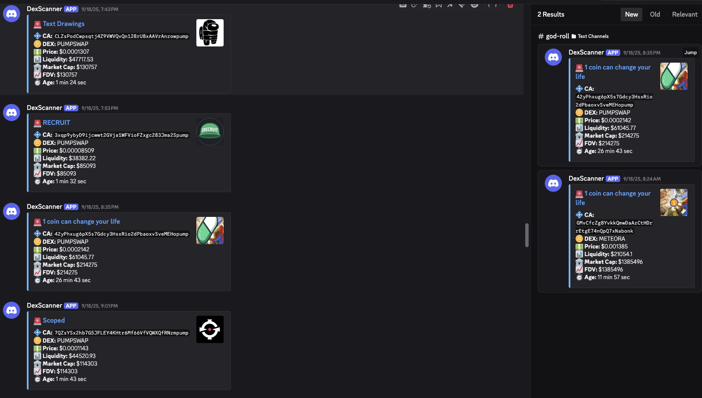

# 👋 Welcome to DexScanner

**Real-time Solana token pair alerts** — get notified on Slack or Discord when new tokens pair.

> 🛰️ Dockerized • 🔔 Fast alerts • 🔒 Open source

---

## 📢 Why DexScanner?

- Monitor new token listings automatically
- Detect scam launches or legit pairs early
- Integrate alerts into your team's Slack/Discord

---

# Token Alerts Watcher (Dockerized)

This project monitors new Solana token pairs and sends alerts to **Slack** and **Discord**.

---

## 📦 Setup

### 1. Clone repo
```bash
git clone https://github.com/dexscanner/DexScanner.git
cd DexScanner
```

### 2. Install dependencies (optional local run)

```bash
pip install -r requirements.txt
```

### 3. Configure

Copy the example config and edit it:

```bash
cp config.json.example config.json
```

Update with your actual Slack and/or Discord webhooks:

```json
{
  "SLACK_WEBHOOK_URL": "https://hooks.slack.com/services/xxx/yyy/zzz",
  "DISCORD_WEBHOOK_URLS": "https://discord.com/api/webhooks/xxx/yyy",
  "USDC_ADDRESSES": [
    "So11111111111111111111111111111111111111112"
  ]
}
```

* ✅ Slack webhooks must be created in your Slack workspace.
* ✅ Discord webhooks can be created from *Channel Settings → Integrations → Webhooks*.

<p align="center">
  
</p>

---

## 🐳 Run with Docker

### 1. Build image

```bash
docker build -t token-alerts .
```

### 2. Run container (with persistence)

```bash
docker run -d --name token-alerts \
  -v $(pwd)/config.json:/app/config.json:ro \
  -v $(pwd)/data:/app/data \
  token-alerts
```

This ensures logs + seen tokens are saved in `./data` on your host:

* `./data/token_alerts.log`
* `./data/seen_tokens.json`

---

## 🔔 Testing Notifications

Before waiting for new tokens, test your webhooks directly:

### Slack test

```bash
curl -X POST -H 'Content-type: application/json' \
--data '{"text":"✅ Slack test from Token Alerts"}' \
https://hooks.slack.com/services/xxx/yyy/zzz
```

### Discord test

```bash
curl -X POST -H "Content-Type: application/json" \
-d '{"content":"✅ Discord test from Token Alerts"}' \
https://discord.com/api/webhooks/xxx/yyy
```

If you don’t see messages, double-check the webhook URL.

---

## 📝 Logs

* Logs are written to `./data/token_alerts.log`.
* Seen tokens are tracked in `./data/seen_tokens.json` to avoid duplicate alerts.

---

## ⏱️ How often?

The watcher runs continuously inside the container and checks **every 60 seconds**.

---

## 🛑 Stopping

```bash
docker stop token-alerts
docker rm token-alerts
```
---
